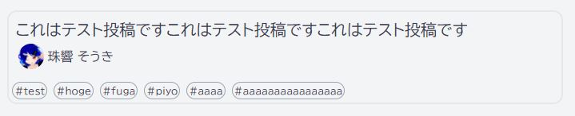

# Virtual Programmer's Network official website

## 開発ドキュメント

ローカルにNode.jsをインストールした環境での開発と、docker-composeでの開発が可能です。

### システム要件(ローカル開発環境)

- 最新の Node.js v16 が動作する環境

### インストール

```sh
npm ci
```

### ビルドして結果を確認する

```sh
npm run build
npm run serve
```

`Ctrl + C` で中止します。

### 実装のために、ホットコード プッシュ環境を作成する

```sh
npm start
```

`Ctrl + C` で中止します。

### システム要件(docker-compose環境)

- 最新のdocker-composeが動作する環境

### 実行方法

以下のコマンドを実行後、[http://localhost:3000]にアクセスします。

```
doocker-compose up
```

### Linting

```sh
npm run lint
```

### コミットについて

試験的に[コミット文の検証(Conventional Commits)](https://www.conventionalcommits.org/ja/v1.0.0/)
を導入しています。このルールに違反する場合、コミットを弾きます。

#### ルールの簡易的説明 (詳細は上記リンク参照)

```txt
<前置詞>: 本文

詳細
```

- 前置詞を `build, chore, ci, docs, feat, fix, perf, refactor, revert, style, test` のいずれかとする
- 本文の頭文字は大文字が、末尾は句点が使えない

#### 例 1

> feat: コンポーネント Hoge を実装した

#### 例 2

> fix: fixed a bug that Hoge component cause crash

### CI/CD について

GitHub Actions を使用した CI/CD を導入しています。

- `main` ブランチに push した場合、ビルドして `out` フォルダを `gh-pages` ブランチへ push します。
- 他のブランチに push した場合、ビルド・Lint を行います。

### メンバー情報を追加する方法

メンバー一覧の情報を、`src/data/member-data.yaml`から読み込んでいます。

`member-data.yaml`から読みこんだ情報は、ブログの著者表示(アイコンと名前)にも利用しています。

情報を追加するには以下のような形式で、`member-data.yaml`に追記してください。

例:
```yaml
# 内部で使用するID, 他の人と被らない適当な英数字
tamayurasouki:
  # Required, 一般的な名前
  name: "珠響 そうき"

  # Optional, メンバー一覧で表示される名前の読み
  alphabetName: "Tamayura Souki"

  # Optional, アイコン画像のパス, 詳細は画像のアップロード方法参照
  # "vpn-website-resource/public/author-icons/tamayurasouki.png"を参照している
  iconPath: "/author-icons/tamayurasouki.png"

  # Optional, メンバー一覧でタグ形式で表記される
  favs:
    - "Python"
    - "Machine_Learning"
    - "CS"
    - "Rust"
    - "Amateur"

  # Optional, メンバー一覧やブログの著者部分につくリンク
  homepageUrl: "https://twitter.com/tamayurasouki"
```

メンバー情報の表示例


### 画像をアップロードする方法

画像等の静的リソースは別のリポジトリ、`vpn-website-resource`で管理しています。
https://github.com/VirtualProgrammersNetwork/vpn-website-resource

`vpn-website-resource`内の`public`以下に適当に配置すれば、ビルド時に自動でリソースとして含まれるようになっています。

`vpn-website-resource/public/author-icons/tamayurasouki.png`
を参照するには
`/author-icons/tamayurasouki.png`と指定してください。

### マークダウンブログを投稿する方法

`src/blog_posts/`以下に配置した`.md`ファイルから、`/posts/`以下にページが生成されます。

マークダウンの先頭に、Front Matterで、ブログに関する情報を書く必要があります。

例:
```yaml
---
title: タイトルを書く # Required, ブログのタイトル
authorId: tamayurasouki # Required, member-data.yamlに記入したID
tags: ["tag1", "tag2"] # Optional, ブログの内容を表すタグ
---
```

ポスト情報の表示例
